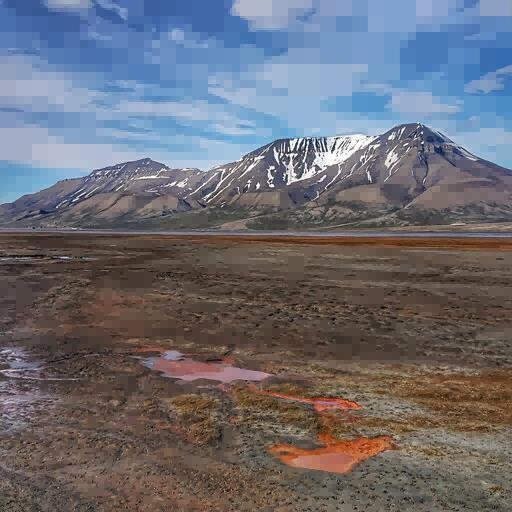
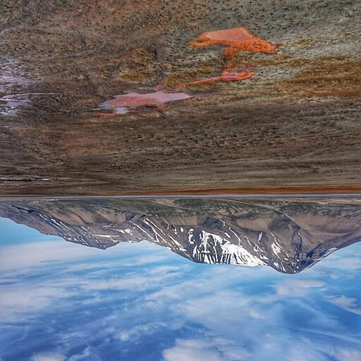
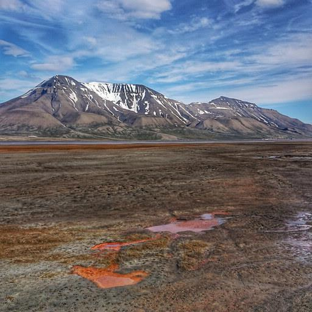
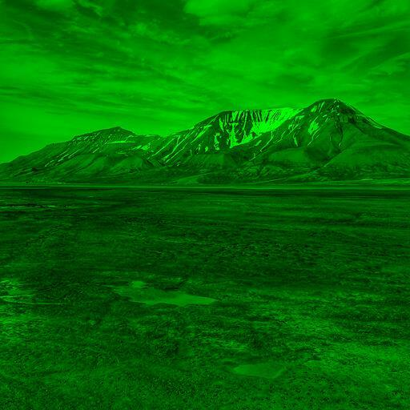
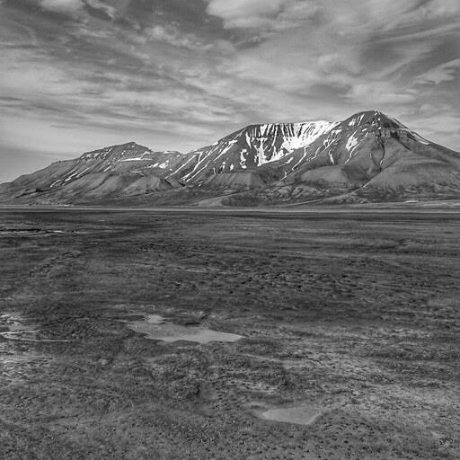

# Image Compression and Manipulation using Quadtrees

The Quadtree Image Compression project aims to provide an efficient compression technique for images using the quadtree data structure. This project contains
1. Image Compression
2. Image Rotation(Horizantal & Vertical Flip)
3. Applying Filters(Red, Blue, Green, Black-White & Grayscale)

Image format :- PPM (Portable Pixmap Format)

## Run Locally

```bash
gcc -Wall main.c Quadtree.c menu.c -o main
./main input.ppm output.ppm
```

Clone the project

```bash
 git clone https://github.com/omkaroak26/DSA2-project.git
```
## Process of image compression:
1. Input the images in PPM(Portable Pixmap Format) format.
2. Read Image Metadata:
    Read the height and width of the image from the PPM file.
3. Create a blank matrix of size height x width to hold the image data
4. Read PPM File and input it into the matrix
5. Compression:
    It includes two sub-steps: uniformity calculation and quadtree creation. <br>
    5.1. Uniformity Calculation:
        Call the uniformity function, which calculates the average of variances within the image.   
    5.2. Create Quadtree:
        The function creates a quadtree data structure that represents the image.
6. Compress Quadtree:
    Compress the quadtree structure. Compress Quadtree until threshold is less than mean value from uniformity.
7. Convert Compressed Quadtree to Matrix:
    Convert the compressed quadtree back into a matrix representation. 
    This step involves decompressing the quadtree structure and reconstructing the matrix.
8. Matrix to PPM:
    Convert the matrix data back into PPM format.
9. Delete matrix and Quadtree to save space

## Process of Image rotation
1. Each parent node or pixel has 4 child nodes. 
2. Thus, the image can be flipped by swapping nodes and calling the main flip function recursively for each child node.
    a. Horizontal Flip: Top left and bottom left are swapped with top right and bottom right respectively. 
    b. Vertical Flip: Top left and top right are swapped with bottom left and bottom right respectively.

## Process of Image filters (R,G,B,B&W,Grayscale)
1. During the application of a red filter to an image, the code recursively calls the function until it reaches a terminal node. 
2. At this node, only the red colour value is preserved, while the green and blue values are set to zero (root->red,0, 0). 
3. This process selectively retains the red colour information, effectively filtering out the green and blue colours.

Similar approach is carried for application of Blue, Green filter and Black-White images.


## Screenshots







## Authors

- [Omkar Oak - 112103099](https://github.com/omkaroak26)
- [Rukmini Nazre - 112103098](https://github.com/rukmini-17)
- [Vardhan Mundada - 112103091](https://github.com/Vardhan-Mundada)


